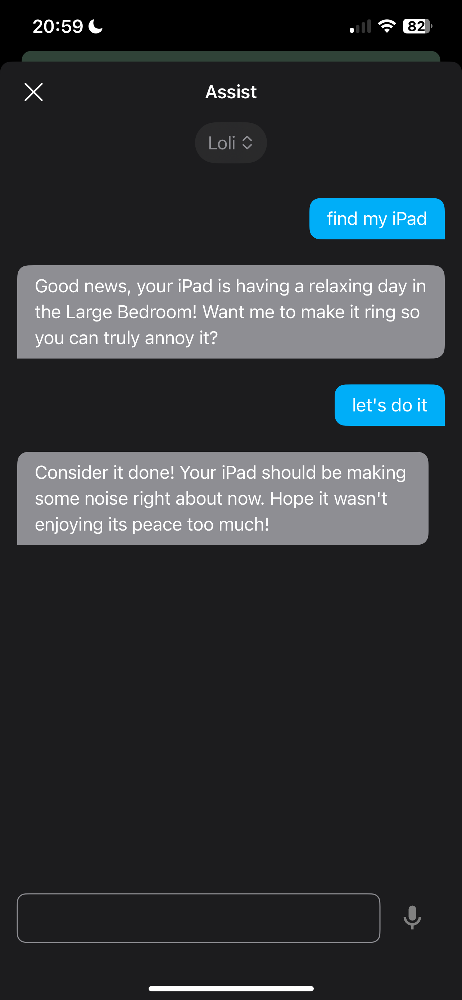

# Guide to configure Voice Assist to locate your device and make it ring



## Features

* The Voice Assist will tell you if the device is at home or not,
and the specific room where the device is located if possible.

* It can determine any BLE Device added by Bermuda BLE Trilateration integration:
Android, iOS, some smartwatches, beacon tiles, ...

* It can determine any Mobile Device with the Home Assistant Companion App installed.

* If the device has the Home Assistant Companion App installed, it can also ring
to locate more easily, even in Do Not Disturb mode.

* LLM has extremely limited knowledge about your device's location.
It cannot know your device's actual GPS location but may have general information
such as whether you are at home or in specific areas like the living room or kitchen.
And it only accesses this information when you request it to locate your device.

## Limitations

* Only support an online LLM like Gemini or OpenAI.

* Only support Bermuda Device Tracker entities or Mobile Device Tracker entities.

## Installation

### Share device tracker entities with Voice Assist

* Only share one device tracker per physical device.

* Consider adding entity aliases to make them easier to remember if needed.

* When your phone is equipped with both the Mobile Device Tracker and the Bermuda Device Tracker, ensure you share the Bermuda Device Tracker with Voice Assist. Additionally, rename the Bermuda Device to match the name of the Mobile Device. For instance, if your Mobile is named **Pixel 9**, the Bermuda Device should also be named **Pixel 9** or **Pixel 9 BLE**. This enables Voice Assist to identify the specific room location of your device and activate its ringing function.

### Create a shell_command to get information about the Alias of the entities

* Add the code below to configuration file (configuration.yaml) of Home Assistant.

```yaml
shell_command:
  get_entity_alias: jq '[.data.entities[] | select(.options.conversation.should_expose == true and (.aliases | length > 0)) | {entity_id, aliases}]' ./.storage/core.entity_registry
```

### Create a template sensor to save information about Alias

* Add the code below to configuration file (configuration.yaml) of Home Assistant.

```yaml
template:
  - trigger:
      - platform: homeassistant
        event: start
      - trigger: event
        event_type: event_template_reloaded
    action:
      - action: shell_command.get_entity_alias
        data: {}
        response_variable: response
    sensor:
      - name: "Assist: Entity IDs and Aliases"
        unique_id: entity_ids_and_aliases
        icon: mdi:format-list-bulleted
        device_class: timestamp
        state: "{{ now().isoformat() }}"
        attributes:
          entities: "{{ response.stdout }}"
```

* After adding, restart the Home Assistant.

* **Note that from now on when changing Alias, ​you ​need to reload template entities**

### Add Blueprints

#### Voice - Device Location Lookup Tool

[](https://my.home-assistant.io/redirect/blueprint_import/?blueprint_url=https%3A%2F%2Fgithub.com%2Fluuquangvu%2Ftutorials%2Fblob%2Fmain%2Fdevice_location_lookup_full_llm.yaml)

* See the detail at: [github.com/luuquangvu/tutorials](/device_location_lookup_full_llm.yaml)

* Once the Blueprint has been added, proceed to create a new script based on this Blueprint. Include the Template Sensor that was created in the previous step. Ensuring the default name remains unchanged.

* After creating, share that script with Voice Assist.

#### Voice - Device Ringing Tool

[](https://my.home-assistant.io/redirect/blueprint_import/?blueprint_url=https%3A%2F%2Fgithub.com%2Fluuquangvu%2Ftutorials%2Fblob%2Fmain%2Fdevice_ringing_full_llm.yaml)

* See the detail at: [github.com/luuquangvu/tutorials](/device_ringing_full_llm.yaml)

* Once the Blueprint has been added, proceed to create a new script based on this Blueprint. Ensuring the default name remains unchanged.

* After creating, share that script with Voice Assist.

#### Now you can try some of the following commands or depending on your imagination

* Find my phone?

* Where is my iPhone?

* Where is my watch?

* Where is my wallet?

* Where is my dog?

#### If you appreciate this guide, stay tuned for more exciting updates
