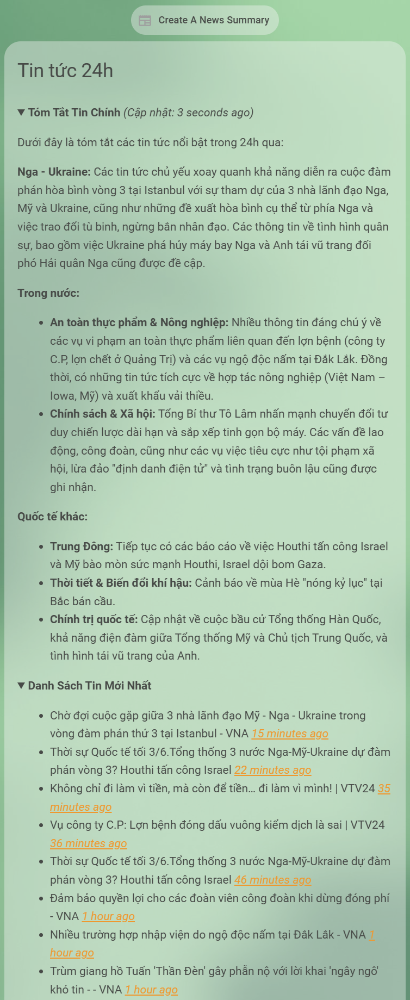

# Hướng dẫn chi tiết lấy tin tức mới nhất và tạo bản tin tổng hợp 24h



- **Cần có LLM của Google hoặc OpenAI để sử dụng tính năng tóm tắt tin.**

## Bước 1: Lấy danh sách tin từ các kênh Youtube tin tức

### Cài đặt tích hợp Feedparser

[](https://my.home-assistant.io/redirect/hacs_repository/?owner=custom-components&repository=feedparser&category=Integration)

- Xem chi tiết tại: [github.com/custom-components/feedparser](https://github.com/custom-components/feedparser)

- Sau khi cài đặt xong cần khởi động lại Home Assistant.

### Lấy ID kênh Youtube tin tức

- Mở Google tìm kiếm theo từ khóa: Get YouTube Channel ID, chọn một trang bất kỳ.

- Nhập đường dẫn kênh YouTube tin tức mà bạn yêu thích để lấy ID của kênh.


### Tạo sensor cho kênh Youtube tin tức

- Sau khi có ID của kênh YouTube tin tức, thêm sensor như sau vào tập tin cấu hình `configuration.yaml` của Home Assistant.

```yaml
sensor:
  - platform: feedparser
    name: CHANNEL_NAME News
    feed_url: https://www.youtube.com/feeds/videos.xml?channel_id=XXXXXX
    scan_interval:
      minutes: 10
    inclusions:
      - title
      - link
      - author
      - published
      - media_thumbnail
      - yt_videoid
    date_format: "%Y-%m-%dT%H:%M:%S%z"
```

- Trong đó CHANNEL_NAME để thành tên kênh YouTube tin tức bạn đang muốn thêm.

- XXXXXX là ID của kênh.

- Ví dụ bên dưới là một số kênh tin tức với nội dung khá phong phú.

  - Kênh VTV24 của Đài Truyền hình Việt Nam.

  - kênh VNA Media của Thông tấn xã Việt Nam.

```yaml
sensor:
  - platform: feedparser
    name: VTV24 News
    feed_url: https://www.youtube.com/feeds/videos.xml?channel_id=UCabsTV34JwALXKGMqHpvUiA
    scan_interval:
      minutes: 10
    inclusions:
      - title
      - link
      - author
      - published
      - media_thumbnail
      - yt_videoid
    date_format: "%Y-%m-%dT%H:%M:%S%z"

  - platform: feedparser
    name: VNA News
    feed_url: https://www.youtube.com/feeds/videos.xml?channel_id=UCmBT5CqUxf3-K5_IU9tVtBg
    scan_interval:
      minutes: 10
    inclusions:
      - title
      - link
      - author
      - published
      - media_thumbnail
      - yt_videoid
    date_format: "%Y-%m-%dT%H:%M:%S%z"
```

- Lặp lại các bước trên với những kênh YouTube tin tức khác bạn muốn thêm nữa.

- **Nếu bạn muốn có tính năng tóm tắt tin 24h qua thì đặc biệt lưu ý:**

  - Không chọn kênh thường xuyên đăng tin với những tiêu đề giật gân không đúng hoặc quá lố với nội dung video.
  - Không chọn kênh thường xuyên đăng tin với những tiêu đề video chung chung không có ý nghĩa rõ ràng.
  - Những điều này sẽ ảnh hưởng tới chất lượng của bản tin tóm tắt 24h qua.

- Sau khi thêm xong khởi động lại Home Assistant.

## Bước 2: Lưu tin tức trong 24h gần nhất

- RSS YouTube chỉ có 15 video gần nhất, với một kênh tin tức thì đó là không đủ số lượng tin trong một ngày. Do đó ta cần có phương án lưu lại toàn bộ nội dung trong 24h gần đây.

### Cài đặt tích hợp Variables+History

[](https://my.home-assistant.io/redirect/hacs_repository/?owner=enkama&repository=hass-variables&category=Integration)

- Xem chi tiết tại: [github.com/enkama/hass-variables](https://github.com/enkama/hass-variables)

- Sau khi cài đặt xong cần khởi động lại Home Assistant.

### Thêm các sensor lưu tin tức

- Tạo 1 Sensor Variable lưu bản tin tóm tắt tổng hợp 24h qua như sau:


- Thêm lần lượt các Sensor Variable lưu tin 24h qua từ các kênh tin tức.

- Cần khai báo Variable ID theo đúng cú pháp để tự động chạy không bị lỗi.

  - Variable Name: CHANNEL_NAME News Last 24 Hours
  - Variable ID: channel_name_news_last_24_hours
  - Value: 0


### Thêm tự động lưu tin khi có tin tức mới

- Tin sẽ được lưu tự động khi có nội dung mới.

- Tin tức cũ hơn 24h sẽ được tự động xóa.

```yaml
alias: Cập nhật dữ liệu khi có tin tức mới
description: ""
triggers:
  - trigger: state
    entity_id:
      - sensor.vtv24_news
      - sensor.vna_news
conditions:
  - condition: template
    value_template: "{{ trigger.from_state.state not in ['unavailable', 'unknown'] }}"
  - condition: template
    value_template: "{{ trigger.to_state.state not in ['unavailable', 'unknown'] }}"
actions:
  - variables:
      old_contents: >-
         {% for entry in
        (state_attr(trigger.entity_id ~ '_last_24_hours', 'entries') |
        default([], true)) if (strptime(entry.published, '%Y-%m-%dT%H:%M:%S%z')
        > (now() - timedelta(hours=24))) -%}   {{ contents.entries }}
      new_contents: "{{ trigger.to_state.attributes.entries | default([], true) }}"
      merged_contents: >-
         {% for entry in
        new_contents if strptime(entry.published, '%Y-%m-%dT%H:%M:%S%z') >
        (strptime(old_contents[0].published, '%Y-%m-%dT%H:%M:%S%z') if
        old_contents else (now() - timedelta(hours=24))) -%}   {{
        contents.entries | sort(reverse=true, attribute='published') }}
  - action: variable.update_sensor
    metadata: {}
    data:
      replace_attributes: true
      attributes:
        entries: "{{ merged_contents }}"
      value: "{{ merged_contents | count }}"
    target:
      entity_id: "{{ trigger.entity_id ~ '_last_24_hours' }}"
    enabled: true
mode: parallel
max: 10
```

### Thêm kịch bản tóm tắt tin tức 24h qua sử dụng AI

- Yêu cầu phiên bản Home Assistant >= 2025.8.0.

```yaml
sequence:
  - variables:
      contents: >-
         {{ merge_response(sources) | sort(reverse=true,
        attribute='published') | map(attribute='title') | list }}
  - action: ai_task.generate_data
    metadata: {}
    data:
      task_name: Tóm tắt các tin tức diễn ra trong 24h qua
      instructions: >-
        Sau đây là danh sách các tin tức trong 24h qua. Hãy phân tích và đưa ra
        bản tóm tắt:


        {{ contents }}
    response_variable: response
  - action: variable.update_sensor
    metadata: {}
    data:
      replace_attributes: true
      attributes:
        summary: "{{ response.data }}"
      value: "{{ now().isoformat() }}"
    target:
      entity_id: sensor.news_summary_last_24_hours
alias: Create A News Summary
description: ""
```

## Bước 3: Đưa ra giao diện

- Do nội dung tin tức thường khá dài, bạn nên tạo một giao diện riêng cho nó như sau:

```yaml
type: masonry
path: news
title: News
icon: mdi:newspaper
cards:
  - type: markdown
    content: >-
      

      


      <details open>


      <summary>

      <b>Tóm Tắt Tin Chính</b> <i>(Cập nhật: {{
      states('sensor.news_summary_last_24_hours') | as_datetime | relative_time
      }} ago)</i>

      </summary>


      

      {{ state_attr('sensor.news_summary_last_24_hours', 'summary') }}

      

      Bản tóm tắt tin tức trong 24h qua đã lỗi thời. Vui lòng cập nhật để có nội
      dung mới.

      


      </details>


      <details open>


      <summary><b>Danh Sách Tin Mới Nhất</b></summary>


      

      - {{ entry.title }} *[{{ strptime(entry.published, '%Y-%m-%dT%H:%M:%S%z')
      | relative_time }} ago]({{ entry.link }})*

      


      </details>
    title: Tin tức 24h
badges:
  - type: entity
    show_name: true
    show_state: false
    show_icon: true
    entity: script.create_a_news_summary
    icon: mdi:newspaper
    tap_action:
      action: perform-action
      confirmation:
        text: >-
          Bạn có muốn tạo một bản tóm tắt ngắn gọn tin tức trong 24h qua ngay
          bây giờ không?
      perform_action: script.turn_on
      target:
        entity_id: script.create_a_news_summary
    color: primary
```
