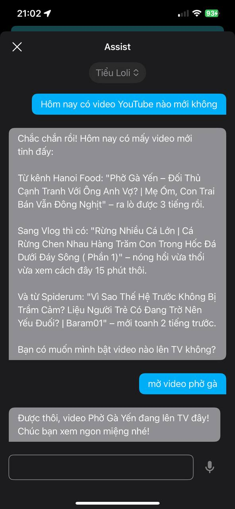
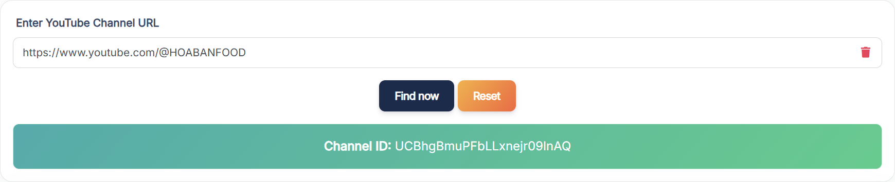
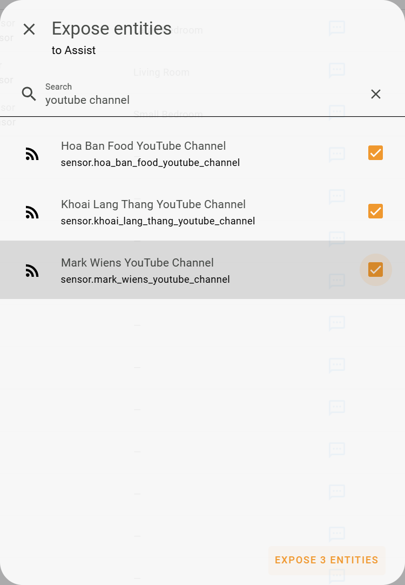
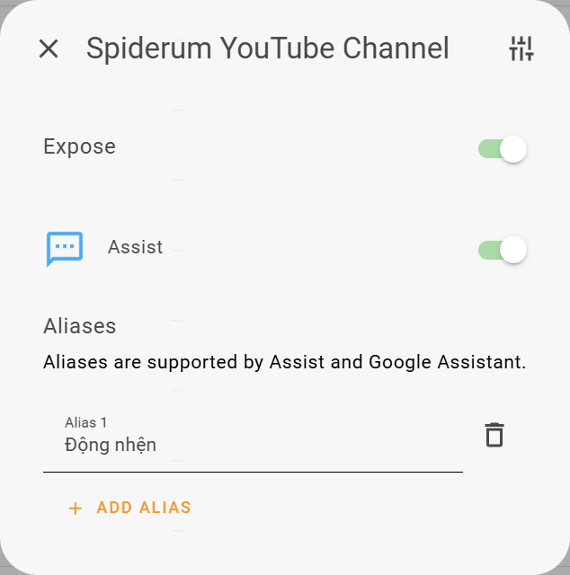
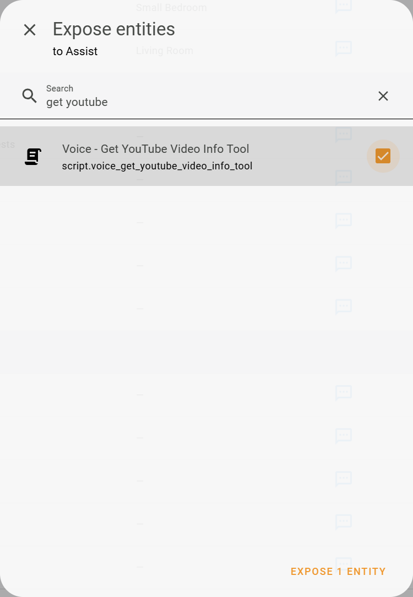
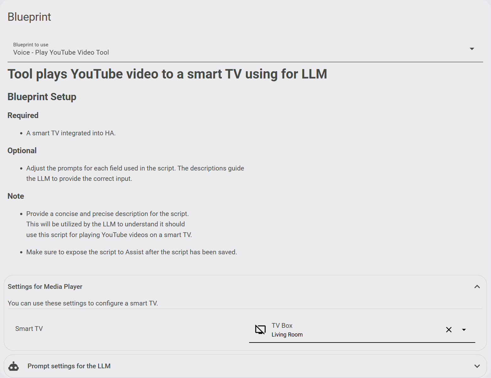
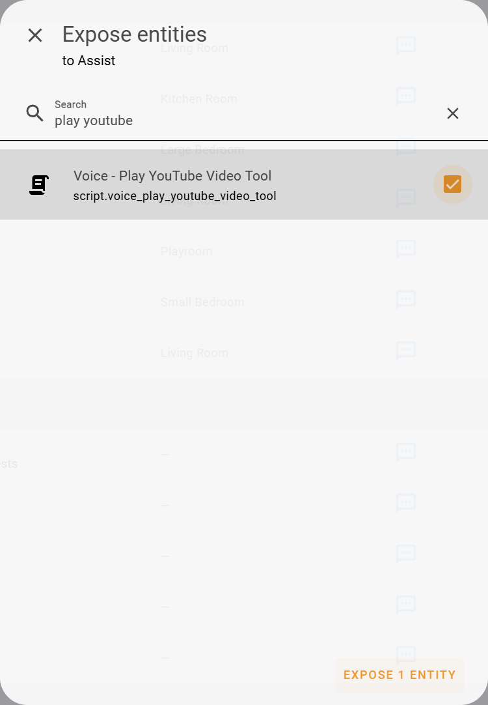

# Hướng dẫn chi tiết cài đặt Voice Assist phát video Youtube lên Smart TV

- **Tính năng mới: Hỗ trợ tạo nhiều alias cho tên kênh.**

- **Tính năng này cho phép bạn sử dụng HA Voice Assist mở một video mới ra mắt gần đây của một kênh YouTube bất kỳ mà bạn yêu thích.**

- **Chỉ hỗ trợ các LLM của Google hay OpenAI.**

- *Với Google cần sử dụng Gemini 2.0 Flash hoặc Gemini 2.5 Flash trở lên.*

- **Tính năng này không hỗ trợ tìm những video cũ từ một kênh.**

- **Tính năng này không hỗ trợ tìm một video bất kỳ trong YouTube.**

- **Yêu cầu cần có một Smart TV đã tích hợp lên Home Assistant**

)

## Bước 1: Lấy thông tin danh sách video từ các kênh Youtube yêu thích

### Cài đặt tích hợp Feedparser

[](https://my.home-assistant.io/redirect/hacs_repository/?owner=custom-components&repository=feedparser&category=Integration)

- Xem chi tiết tại: [github.com/custom-components/feedparser](https://github.com/custom-components/feedparser)

- Lưu ý tính đến thời điểm hiện tại (2025-06-04) tích hợp Feedparser chưa hỗ trợ unique_id. Do đó không thể thêm được alias cho tên kênh YouTube.

- Mình đã tạo pull request, các bạn chờ tác giả cập nhật nhé. Chi tiết theo dõi tại: [github.com/custom-components/feedparser/pull/143](https://github.com/custom-components/feedparser/pull/143)

- Hoặc các bạn có thể sửa code như trong pull request để trải nghiệm sớm tính năng mới.

- Sau khi cài đặt xong cần khởi động lại Home Assistant.

### Lấy ID kênh Youtube

- Mở Google tìm kiếm theo từ khóa: Get YouTube Channel ID, chọn một trang bất kỳ.

- Nhập đường dẫn kênh YouTube mà bạn yêu thích để lấy ID của kênh.



### Tạo sensor cho kênh YouTube

- Sau khi có ID của kênh YouTube, thêm sensor như sau vào tập tin cấu hình configuration.yaml của Home Assistant.

```yaml
sensor:
  - platform: feedparser
    name: CHANNEL_NAME YouTube Channel
    feed_url: https://www.youtube.com/feeds/videos.xml?channel_id=XXXXXX
    scan_interval:
      minutes: 30
    inclusions:
      - title
      - link
      - author
      - published
      - media_thumbnail
      - yt_videoid
    date_format: "%Y-%m-%dT%H:%M:%S%z"
```

- Trong đó CHANNEL_NAME để thành tên kênh YouTube bạn đang muốn thêm.

- XXXXXX là ID của kênh.

- Lưu ý cụm từ **YouTube Channel** trong tên sẽ là cố định gán cho mọi kênh muốn thêm.

- Ví dụ bên dưới một kênh mình rất thích xem, kênh Hoa Ban Food.

```yaml
sensor:
  - platform: feedparser
    name: Hoa Ban Food YouTube Channel
    feed_url: https://www.youtube.com/feeds/videos.xml?channel_id=UCBhgBmuPFbLLxnejr09lnAQ
    scan_interval:
      minutes: 30
    inclusions:
      - title
      - link
      - author
      - published
      - media_thumbnail
      - yt_videoid
    date_format: "%Y-%m-%dT%H:%M:%S%z"
```

- Lặp lại các bước trên với những kênh YouTube khác bạn muốn thêm nữa.

- Sau khi thêm xong khởi động lại Home Assistant.

### Chia sẻ kênh YouTube với Assist

- Sau khi khởi động lại, chia sẻ sensor các kênh YouTube mới tạo đó với Assist.



- Tạo thêm các alias cho các kênh nếu muốn. Ví dụ trường hợp kênh nước ngoài, ta có thể đặt thêm alias cho dễ gọi.



### Tạo một shell_command để lấy thông tin về alias

- Thêm vào tập tin cấu hình configuration.yaml của Home Assistant.

```yaml
shell_command:
  get_entity_alias: jq '[.data.entities[] | select(.options.conversation.should_expose == true and (.aliases | length > 0)) | {aliases, entity_id}]' ./.storage/core.entity_registry
```

### Tạo một sensor để lưu thông tin về alias

- Thêm vào tập tin cấu hình configuration.yaml của Home Assistant.

```yaml
template:
  - trigger:
      - platform: homeassistant
        event: start
      - trigger: event
        event_type: event_template_reloaded
    action:
      - service: shell_command.get_entity_alias
        data: {}
        response_variable: response
    sensor:
      - name: "Assist: Entity IDs and Aliases"
        unique_id: entity_ids_and_aliases
        state: "{{ now().isoformat() }}"
        attributes:
          entities: "{{ response.stdout }}"
```

- Sau khi thêm xong khởi động lại Home Assistant.

- **Lưu ý về sau mỗi khi thay đổi alias cần phải reload template**

## Bước 2: Thêm kịch bản cho Assist

### Cài đặt Blueprint sau

[](https://my.home-assistant.io/redirect/blueprint_import/?blueprint_url=https%3A%2F%2Fgithub.com%2Fluuquangvu%2Ftutorials%2Fblob%2Fmain%2Fget_youtube_video_info_full_llm.yaml)

- Xem chi tiết tại: [github.com/luuquangvu/tutorials/blob/main/get_youtube_video_info_full_llm.yaml](https://github.com/luuquangvu/tutorials/blob/main/get_youtube_video_info_full_llm.yaml)

- Sau khi thêm blueprint, tạo một kịch bản mới từ blueprint này. **Giữ tên kịch bản mặc định không thay đổi.**

- Sau khi tạo xong, chia sẻ kịch bản đó với Assist.



### Cài đặt Blueprint tiếp theo

[](https://my.home-assistant.io/redirect/blueprint_import/?blueprint_url=https%3A%2F%2Fgithub.com%2Fluuquangvu%2Ftutorials%2Fblob%2Fmain%2Fplay_youtube_video_full_llm.yaml)

- Xem chi tiết tại: [github.com/luuquangvu/tutorials/blob/main/play_youtube_video_full_llm.yaml](https://github.com/luuquangvu/tutorials/blob/main/play_youtube_video_full_llm.yaml)

- Sau khi thêm blueprint, tạo một kịch bản mới từ blueprint này. Chỉ định một Smart TV sẽ phát video lên khi gọi Assist. **Giữ tên kịch bản mặc định không thay đổi.**



- Sau khi tạo xong, chia sẻ kịch bản đó với Assist.



- **Vậy là xong. Bây giờ bạn có thể thử với một số mẫu câu lệnh như sau, hoặc tùy trí tưởng tượng của bạn:**

  - Hôm nay có video YouTube nào mới không? -> Assist trả lời -> Mở video XXX nhé (XXX chỉ cần là 1 phần nhỏ trong tiêu đề của video).

  - Gần đây [Tên Kênh] có video nào mới không? Hãy phát nó lên TV ngay bây giờ.

  - Tuần này [Tên Kênh] và [Tên Kênh] có video mới không? -> Assist trả lời -> Mở video XXX nhé.

  - Tháng này [Tên Kênh] hay là [Tên Kênh] có video nào mới không? Hãy phát nó lên TV ngay bây giờ.

- **Nếu bạn thích tính năng này, hãy theo dõi để đón chờ thêm những tính năng mới hay ho hơn nữa nhé.**
