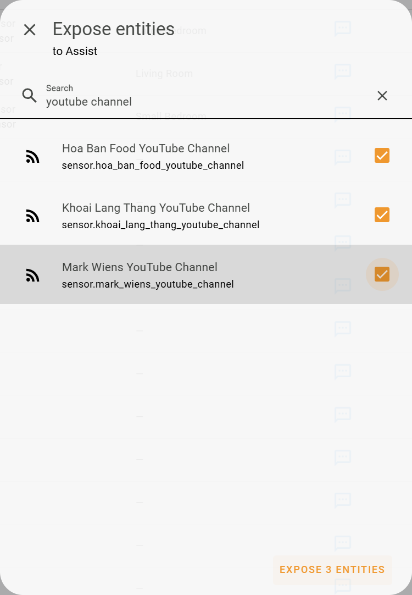
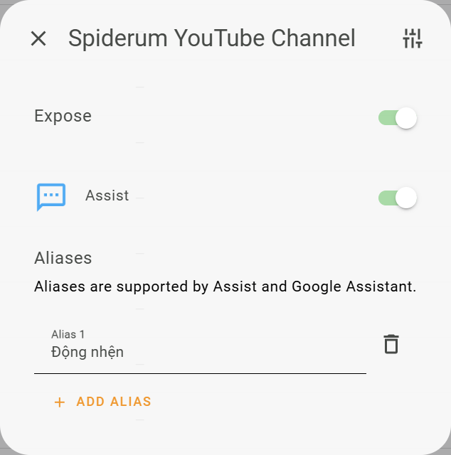

# Detailed Guide: Voice Assist to Play YouTube Videos on Smart TV

This guide allows you to use Home Assistant Voice to play the latest videos from your favorite YouTube channels directly on your Smart TV.

## Introduction & Key Features

- **Purpose:** Automatically play the most recently released video from any YouTube channel you love.
- **LLM Support:** Only works with LLMs like Google or OpenAI.
- **Alias Support:** You can create multiple aliases for channel names to make them easier to call by voice.

### Limitations

- Does not support searching for old videos from a channel.
- Does not support searching for arbitrary videos across all of YouTube (only searches the latest video of followed channels).
- Requires a Smart TV or media player device integrated into Home Assistant.


## Step 1: Get Video Info from Favorite YouTube Channels

### 1.1. Install Feedparser Integration

Feedparser is an integration that helps Home Assistant read RSS/Atom feeds, including YouTube video feeds.

[](https://my.home-assistant.io/redirect/hacs_repository/?owner=custom-components&repository=feedparser&category=Integration)

- See details at: [github.com/custom-components/feedparser](https://github.com/custom-components/feedparser)
- _Note:_ As of `December 10, 2025`, the Feedparser integration does not yet fully support `unique_id` to easily create aliases via the UI. You can follow the progress at [this pull request](https://github.com/custom-components/feedparser/pull/143) or modify the code yourself if you want this feature early.
- After installing via HACS, you must **restart** Home Assistant.

### 1.2. Get YouTube Channel ID

You need the ID of the YouTube channel to configure the sensor.

1.  Open Google and search for `Get YouTube Channel ID`.
2.  Visit any site (e.g., `https://commentpicker.com/youtube-channel-id.php`).
3.  Enter the URL of the YouTube channel you want to follow to get its ID.


### 1.3. Configure Sensor for YouTube Channel

Once you have the channel ID, add the sensor configuration to your `config/configuration.yaml` file:

```yaml
sensor:
  - platform: feedparser
    name: CHANNEL_NAME YouTube Channel # Change CHANNEL_NAME to your desired channel name
    feed_url: https://www.youtube.com/feeds/videos.xml?channel_id=XXXXXX # Replace XXXXXX with the Channel ID
    scan_interval:
      minutes: 30 # Check frequency (default 30 minutes)
    inclusions:
      - title
      - link
      - author
      - published
      - media_thumbnail
      - yt_videoid
    date_format: "%Y-%m-%dT%H:%M:%S%z"
```

- **Note:** The phrase "YouTube Channel" in the sensor name is fixed and critical for the LLM to identify it.
- _Example configuration for a channel named "Hoa Ban Food":_

```yaml
sensor:
  - platform: feedparser
    name: Hoa Ban Food YouTube Channel
    feed_url: https://www.youtube.com/feeds/videos.xml?channel_id=UCBhgBmuPFbLLxnejr09lnAQ
    scan_interval:
      minutes: 30
    inclusions:
      - title
      - link
      - author
      - published
      - media_thumbnail
      - yt_videoid
    date_format: "%Y-%m-%dT%H:%M:%S%z"
```

- Repeat the steps above for all YouTube channels you want to follow.
- After configuration, **restart** Home Assistant.

### 1.4. Share Sensor with Assist and Create Aliases

For Voice Assist to recognize and interact with your YouTube channels:

1.  After restarting HA, go to **Settings** > **Voice assistants** > **Expose**.
2.  Find and expose the newly created YouTube channel sensors.



3.  Create additional **Aliases** for the channels (e.g., "Hoa Ban", "Son Tung") to make them easier to remember or pronounce, especially for foreign channels.



### 1.5. Configure Alias Support for Assist

To help Assist understand the Aliases you created, we need a `shell_command` and a shared `template sensor`.

**Add to `configuration.yaml`:**
(Ensure `jq` is installed on your Home Assistant system)

```yaml
shell_command:
  get_entity_alias: jq '[.data.entities[] | select(.options.conversation.should_expose == true and (.aliases | length > 0)) | {entity_id, aliases}]' ./.storage/core.entity_registry
```

**Add to `configuration.yaml` (under `template:` or merge with existing config):**

```yaml
template:
  - triggers:
      - trigger: homeassistant
        event: start
      - trigger: event
        event_type: event_template_reloaded
    actions:
      - action: shell_command.get_entity_alias
        response_variable: response
    sensor:
      - name: "Assist: Entity IDs and Aliases"
        unique_id: entity_ids_and_aliases
        icon: mdi:format-list-bulleted
        device_class: timestamp
        state: "{{ now().isoformat() }}"
        attributes:
          entities: "{{ response.stdout }}"
```

- After adding, **restart** Home Assistant.
- **Note:** Whenever you change an Alias, you must **reload template entities** (from Developer Tools > YAML) or restart HA to update.

## Step 2: Add Scripts for Assist

### 2.1. Install "Get Video Info" Blueprint

This blueprint helps Assist fetch the latest video info from the requested YouTube channel.

[](https://my.home-assistant.io/redirect/blueprint_import/?blueprint_url=https%3A%2F%2Fgithub.com%2Fluuquangvu%2Ftutorials%2Fblob%2Fmain%2Fget_youtube_video_info_full_llm.yaml)

- **Steps:**
  1.  Import the blueprint.
  2.  Create a new **Script** from this blueprint.
  3.  Select the Template Sensor (`sensor.assist_entity_ids_and_aliases`) created in step 1.5.
  4.  **Important:** Keep the default Script name.
  5.  After creating, **Expose** that script to Voice Assist.

### 2.2. Install "Play Video" Blueprint

This blueprint is responsible for playing the found video on your media player device.

[](https://my.home-assistant.io/redirect/blueprint_import/?blueprint_url=https%3A%2F%2Fgithub.com%2Fluuquangvu%2Ftutorials%2Fblob%2Fmain%2Fplay_youtube_video_full_llm.yaml)

- **Steps:**
  1.  Import the blueprint.
  2.  Create a new **Script** from this blueprint.
  3.  Select a Smart TV or media player device to play the video on.
  4.  **Important:** Keep the default Script name.


- After creating, **Expose** that script to Voice Assist.

## 3. Example Voice Commands

That's it! Now you can try some of the following command patterns, or improvise as you wish:

- "Are there any new YouTube videos today?" -> (Assist replies) -> "Open video XXX" (XXX is a small part of the video title).
- "Has [Channel Name] released any new videos recently? Play it on the TV right now."
- "Do [Channel Name 1] and [Channel Name 2] have new videos this week?" -> (Assist replies) -> "Open video XXX."
- "Does [Channel Name 1] or [Channel Name 2] have any new videos this month? Play it on the TV now."

---

**If you find this feature useful, stay tuned for more cool features coming soon!**
