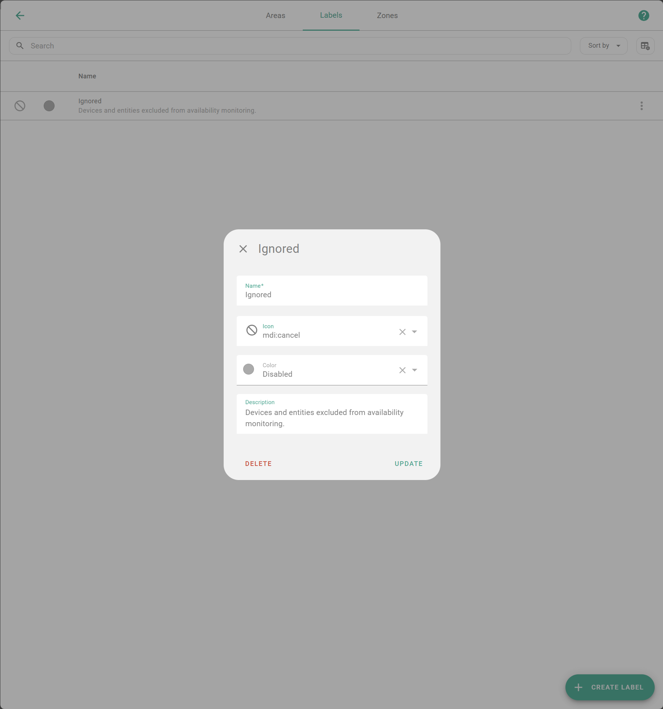
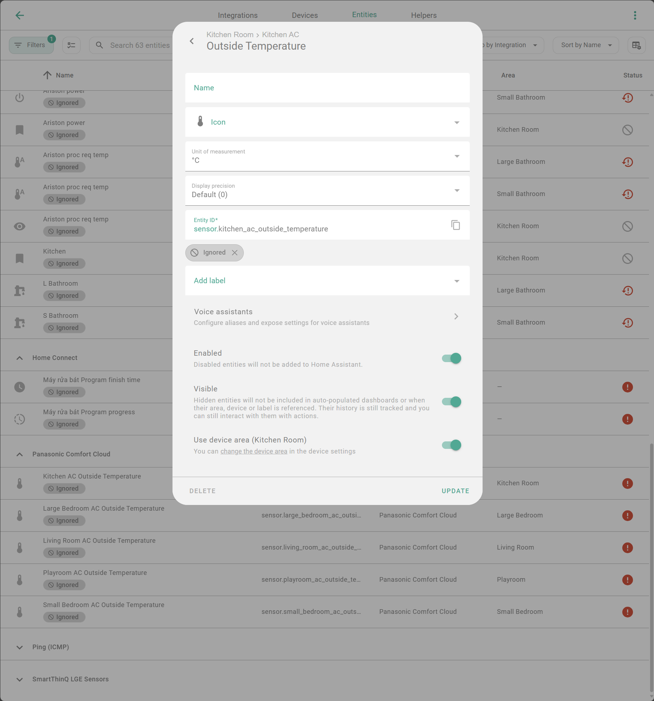

# Giám sát & Thông báo Thiết bị Mất Kết nối (Unavailable Devices)

Hướng dẫn này giúp bạn tự động theo dõi và nhận thông báo khi có bất kỳ thiết bị nào trong Home Assistant chuyển sang trạng thái "Không khả dụng" (Unavailable) hoặc "Không rõ" (Unknown).

## Bước 1: Tạo cảm biến theo dõi (Sensor)

Chúng ta sẽ tạo một `binary_sensor` thông minh, tự động quét toàn bộ hệ thống để tìm các thiết bị lỗi, đồng thời cho phép bạn loại trừ (bỏ qua) các thiết bị không quan trọng.

### 1.1. Tạo nhãn (Label) để quản lý

Để tránh báo động giả từ các thiết bị bạn không quan tâm, hãy tạo một nhãn để đánh dấu chúng.

1.  Vào **Settings** > **Devices & Services** > **Labels**.
2.  Tạo nhãn mới tên là: `ignored`



### 1.2. Gán nhãn cho thiết bị cần bỏ qua

Gán nhãn `ignored` cho bất kỳ thiết bị hoặc thực thể nào bạn **không** muốn nhận thông báo khi nó mất kết nối.



### 1.3. Cấu hình Template Sensor

Thêm đoạn mã sau vào file `configuration.yaml` của bạn. Sensor này sẽ tự động lọc bỏ các thiết bị có nhãn `ignored`, cũng như các thực thể nút bấm (button) hoặc ngữ cảnh (scene) vốn không có trạng thái kết nối.

```yaml
template:
  - binary_sensor:
      - name: Unavailable Devices
        unique_id: unavailable_devices
        device_class: problem
        icon: >-
          {{ iif((this.attributes.raw | default([], true) | length > 0), 'mdi:alert-circle', 'mdi:check-circle') }}
        state: >-
          {{ this.attributes.raw | default([], true) | length > 0 }}
        attributes:
          devices: >-
            {{ this.attributes.raw | default([], true) | map('device_id') | reject('none') | unique | map('device_attr', 'name') | list }}
          entities: >-
            {{ this.attributes.raw | default([], true) }}
          raw: >-
            
            
            
            
            
              
            
            
            
            
              
              
                
              
            
            {{ ns.final }}
```

_Sau khi lưu file, hãy **Khởi động lại (Restart)** Home Assistant để áp dụng._

## Bước 2: Tạo Thông báo Tự động (Automation)

Các automation dưới đây sẽ gửi thông báo khi có sự cố, và tự động xóa thông báo khi sự cố được khắc phục.

### Tùy chọn 1: Thông báo Persistent (trên giao diện Home Assistant)

```yaml
alias: "System: Thông báo thiết bị mất kết nối (Persistent)"
description: ""
triggers:
  - trigger: state
    entity_id:
      - binary_sensor.unavailable_devices
    attribute: entities
conditions:
  - condition: template
    value_template: "{{ trigger.from_state.state not in ['unavailable', 'unknown'] }}"
  - condition: template
    value_template: "{{ trigger.to_state.state not in ['unavailable', 'unknown'] }}"
actions:
  - variables:
      entities: "{{ state_attr(trigger.entity_id, 'entities') | default([], true) }}"
      devices: "{{ state_attr(trigger.entity_id, 'devices') | default([], true) }}"
      notify_tag: "{{ 'tag_' ~ this.attributes.id }}"
  - if:
      - condition: template
        value_template: "{{ entities | length > 0 }}"
    then:
      - action: persistent_notification.create
        data:
          notification_id: "{{ notify_tag }}"
          title: "Thiết bị mất kết nối"
          message: |-
            ### Có {{ devices | length }} thiết bị ({{ entities | length }} thực thể) gặp sự cố.

            **Thiết bị:**
            - {{ device }}
            

            **Chi tiết thực thể:**
            - {{ entity }}
            
    else:
      - action: persistent_notification.dismiss
        data:
          notification_id: "{{ notify_tag }}"
mode: queued
max: 10
```

### Tùy chọn 2: Thông báo qua Điện thoại (Mobile App)

```yaml
alias: "System: Thông báo thiết bị mất kết nối (Mobile)"
description: ""
triggers:
  - trigger: state
    entity_id:
      - binary_sensor.unavailable_devices
    attribute: entities
conditions:
  - condition: template
    value_template: "{{ trigger.from_state.state not in ['unavailable', 'unknown'] }}"
  - condition: template
    value_template: "{{ trigger.to_state.state not in ['unavailable', 'unknown'] }}"
actions:
  - variables:
      entities: "{{ state_attr(trigger.entity_id, 'entities') | default([], true) }}"
      devices: "{{ state_attr(trigger.entity_id, 'devices') | default([], true) }}"
      notify_tag: "{{ 'tag_' ~ this.attributes.id }}"
  - if:
      - condition: template
        value_template: "{{ entities | length > 0 }}"
    then:
      - action: notify.mobile_app_iphone # Thay bằng tên điện thoại của bạn
        data:
          title: "Mất kết nối thiết bị"
          message: >-
            Có {{ devices | length }} thiết bị ({{ entities | length }} thực thể) đang bị mất kết nối.
          data:
            tag: "{{ notify_tag }}"
            url: /lovelace/system # (Tùy chọn) Đường dẫn đến dashboard hệ thống của bạn
    else:
      - action: notify.mobile_app_iphone # Thay bằng tên điện thoại của bạn
        data:
          message: clear_notification
          data:
            tag: "{{ notify_tag }}"
mode: queued
max: 10
```

## Bước 3: Hiển thị trên Dashboard (Tùy chọn)

Bạn có thể thêm thẻ Markdown này vào giao diện. Nó sẽ tự động ẩn đi khi hệ thống bình thường và chỉ hiện lên khi có thiết bị lỗi.

```yaml
type: markdown
title: Thiết bị Mất Kết nối
content: |-
  
  

  **Tổng quan:** {{ devices | length }} thiết bị - {{ entities | length }} thực thể.

  ---
  **Danh sách thiết bị:**
  - **{{ device }}**
  

  **Chi tiết thực thể:**
  - `{{ entity }}`
  
visibility:
  - condition: state
    entity: binary_sensor.unavailable_devices
    state: "on"
```
