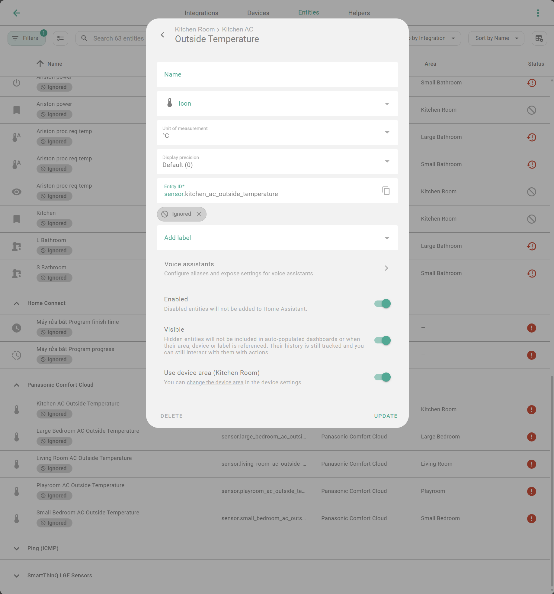

# Monitoring & Notifying Unavailable Devices

This guide helps you automatically monitor and receive notifications whenever any device in Home Assistant becomes "Unavailable" or "Unknown".

## Step 1: Create a Monitoring Sensor

We will create a smart `binary_sensor` that automatically scans your entire system for faulty devices, while allowing you to exclude (ignore) unimportant ones.

### 1.1. Create a Label for Management

To avoid false alarms from devices you don't care about, create a label to mark them.

1.  Go to **Settings** > **Devices & Services** > **Labels**.
2.  Create a new label named: `ignored`


### 1.2. Assign the Label to Ignored Devices

Assign the `ignored` label to any device or entity you **do not** want to be notified about when it goes offline.



### 1.3. Configure Template Sensor

Add the following code to your `configuration.yaml` file. This sensor automatically filters out devices with the `ignored` label, as well as button or scene entities which naturally don't have a connection state.

```yaml
template:
  - binary_sensor:
      - name: Unavailable Devices
        unique_id: unavailable_devices
        device_class: problem
        icon: >-
          {{ iif((this.attributes.raw | default([], true) | length > 0), 'mdi:alert-circle', 'mdi:check-circle') }}
        state: >-
          {{ this.attributes.raw | default([], true) | length > 0 }}
        attributes:
          devices: >-
            {{ this.attributes.raw | default([], true) | map('device_id') | reject('none') | unique | map('device_attr', 'name') | list }}
          entities: >-
            {{ this.attributes.raw | default([], true) }}
          raw: >-
            
            
            
            
            
              
            
            
            
            
              
              
                
              
            
            {{ ns.final }}
```

_After saving the file, please **Restart** Home Assistant to apply the changes._

## Step 2: Create Automation Notifications

The automations below will send a notification when an issue occurs, and automatically clear the notification when the issue is resolved.

### Option 1: Persistent Notification (on Home Assistant Dashboard)

```yaml
alias: "System: Notify Unavailable Devices (Persistent)"
description: ""
triggers:
  - trigger: state
    entity_id:
      - binary_sensor.unavailable_devices
    attribute: entities
conditions:
  - condition: template
    value_template: "{{ trigger.from_state.state not in ['unavailable', 'unknown'] }}"
  - condition: template
    value_template: "{{ trigger.to_state.state not in ['unavailable', 'unknown'] }}"
actions:
  - variables:
      entities: "{{ state_attr(trigger.entity_id, 'entities') | default([], true) }}"
      devices: "{{ state_attr(trigger.entity_id, 'devices') | default([], true) }}"
      notify_tag: "{{ 'tag_' ~ this.attributes.id }}"
  - if:
      - condition: template
        value_template: "{{ entities | length > 0 }}"
    then:
      - action: persistent_notification.create
        data:
          notification_id: "{{ notify_tag }}"
          title: "Devices Unavailable"
          message: |-
            ### {{ devices | length }} devices ({{ entities | length }} entities) are having issues.

            **Devices:**
            - {{ device }}
            

            **Entity Details:**
            - {{ entity }}
            
    else:
      - action: persistent_notification.dismiss
        data:
          notification_id: "{{ notify_tag }}"
mode: queued
max: 10
```

### Option 2: Mobile App Notification

```yaml
alias: "System: Notify Unavailable Devices (Mobile)"
description: ""
triggers:
  - trigger: state
    entity_id:
      - binary_sensor.unavailable_devices
    attribute: entities
conditions:
  - condition: template
    value_template: "{{ trigger.from_state.state not in ['unavailable', 'unknown'] }}"
  - condition: template
    value_template: "{{ trigger.to_state.state not in ['unavailable', 'unknown'] }}"
actions:
  - variables:
      entities: "{{ state_attr(trigger.entity_id, 'entities') | default([], true) }}"
      devices: "{{ state_attr(trigger.entity_id, 'devices') | default([], true) }}"
      notify_tag: "{{ 'tag_' ~ this.attributes.id }}"
  - if:
      - condition: template
        value_template: "{{ entities | length > 0 }}"
    then:
      - action: notify.mobile_app_iphone # Replace with your phone's notification service
        data:
          title: "Devices Lost Connection"
          message: >-
            {{ devices | length }} devices ({{ entities | length }} entities) are currently unavailable.
          data:
            tag: "{{ notify_tag }}"
            url: /lovelace/system # (Optional) Path to your system dashboard
    else:
      - action: notify.mobile_app_iphone # Replace with your phone's notification service
        data:
          message: clear_notification
          data:
            tag: "{{ notify_tag }}"
mode: queued
max: 10
```

## Step 3: Dashboard Display (Optional)

You can add this Markdown card to your dashboard. It will automatically hide when the system is healthy and only appear when there are faulty devices.

```yaml
type: markdown
title: Unavailable Devices
content: |-
  
  

  **Overview:** {{ devices | length }} devices - {{ entities | length }} entities.

  ---
  **Device List:**
  - **{{ device }}**
  

  **Entity Details:**
  - `{{ entity }}`
  
visibility:
  - condition: state
    entity: binary_sensor.unavailable_devices
    state: "on"
```
